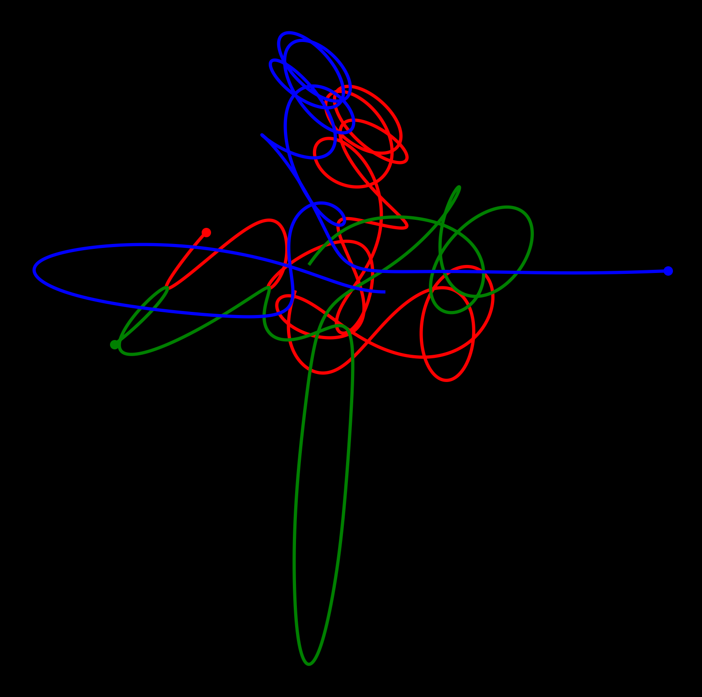

I have implemented a 3-body problem simulator that generates the three-voice noise corresponding to the motion of each body. A one-minute video is available at [this YouTube link](https://youtube.com/watch?v=MbhX1uRd6BI).

{:height="80%" width="80%" style="display: block; margin: 0 auto"}
*figure. One example of the generated frames*

## What I did

### Three-body problem simulator

The three-body problem is a classic problem in physics. When two celestial bodies interact with gravity, their motion can be described in a closed form; for example, their orbits are conic sections. However, the situation is different when a third body is introduced. It is known that there is no general solution to the three-body problem, and the motion can be chaotic, i.e., the system can be extremely sensitive to initial conditions.

The first season of the Netflix series [3 Body Problem](https://www.imdb.com/title/tt13016388/) has recently been released. Not only did I enjoy the series, but also I became somewhat obsessed with the physical problem in the title and ended up implementing the simulator in Python.

Because of the visualization problem, my implementation is on the plane. Implementing 3-dimensional motion would not be much different.

### Noise generation

After the simulator was finished, I wondered how to make this video more entertaining; the answer is always to add the perfect sound. I decided to create three noises, corresponding to the motion of each body.

I set the center of mass, which is set to be fixed at the center of the screen, to be the origin $O$. Let $(r,\theta)$ be the polar coordinate of a body. I set the frequency of the noise to be proportional to $\theta$ and the amplitude to $r$; that is, the pitch of noise increases when the body rotates around the center (one octave higher when the body rotates one turn), and the volume increases when the body is far from the center, and vice versa for the opposite cases.

Note that the angle $\theta$ respects the multiple rotation, so that there is a continuous change in pitch when $\theta$ passes through $2n\pi$ (for integer $n$).

### Video generation

I simply collected the frames to make a video and added the generated noise.

The result with an initial condition is the video at the link above. I don't know why, but those videos are oddly satisfying.

## What I've learned

### Stick to the correct use of numpy

I learned (again) that `numpy` is a powerful tool for numerical analysis, but only if it is used correctly. For example, broadcasting, reshaping, and vectorization should be used whenever possible, otherwise the performance can be significantly reduced. I also learned (again) that one shouldn't append to the numpy array often, as this process creates a new array each time. (This is different from the native Python list, which makes me forget the numpy way); one should rather allocate the zero array first and fill it when there is a time bottleneck and enough memory.

### Some numerical methods

I've never done numerical simulations of differential equations before. Doing this, I learned that there are several methods to estimate the state at $t + \Delta t$ from the state at $t$. My first implementation was naive, and the energy of the system was not conserved. The current implementation supports the leapfrog method and the velocity Verlet method. I have checked that the net energy tends to be conserved better.

### On video generation

A few years ago I did another music visualization project: [Giant Steps (on the circle of 5ths)](https://www.youtube.com/shorts/88ri19nUb8U). On that one, the most time-consuming part was generating the video itself. I created and saved each of the frame images in Python, and then combined them into a video using some other software. Generating and saving this bunch of still images took a lot of time (as it is file io) and disk space.

This time, not to repeat the pain, I did some research and found that each frame can be converted into a `numpy` array and then directly into a video using, for example, the `moviepy` library. This reduced the time and memory consumption significantly.

## What to do next, if I do

1. Refactor the code

   For example, I just created a `.wav` file and re-read it to convert it into a compatible format with the `moviepy` library; this should also be possible directly, but I haven't done much research.

2. Live simulation, maybe with JavaScript or something

   The current implementation finishes the simulation and then starts the video generation. I'm not sure if it is possible to do this in real-time in Python; parallel processing has always been a problem whenever I try to do large computations in Python. Maybe converting to another language for the live simulation would be easier.